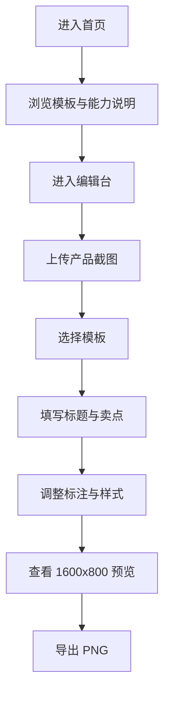

## 1. 产品概述
`tuhaokan` 是一个面向 ISV 的产品宣传图制作工具，帮助用户基于产品截图在几分钟内生成可下载的宣传图。
- 核心目标是降低 ISV 运营、产品市场、售前团队制作宣传物料的门槛，围绕固定尺寸 `1600px × 800px` 提供模板化生成体验。
- 首版聚焦“上传截图、选择模板、微调文案与样式、导出图片”的闭环，不引入复杂账号体系与在线协作能力。

## 2. 核心功能

### 2.1 功能模块
1. **首页**：产品价值说明、模板总览、开始制作入口。
2. **编辑台**：截图上传、模板选择、画布预览、文本编辑、卖点配置、导出下载。

### 2.2 页面详情
| 页面名称 | 模块名称 | 功能说明 |
|-----------|-------------|---------------------|
| 首页 | Hero 区 | 说明产品定位、固定输出尺寸、适用人群与核心动作入口 |
| 首页 | 模板库预览 | 展示模板分类、模板缩略图、模板适用场景 |
| 首页 | 首版能力说明 | 说明上传截图、替换文案、下载 PNG 的使用流程 |
| 编辑台 | 素材上传区 | 支持上传 1 到 3 张产品截图，展示缩略图与替换操作 |
| 编辑台 | 模板选择区 | 提供模板卡片，切换时立即刷新预览画布 |
| 编辑台 | 文案配置区 | 编辑标题、副标题、卖点、角标、品牌名、按钮文案 |
| 编辑台 | 标注配置区 | 为截图添加解释说明、箭头、编号与高亮框 |
| 编辑台 | 样式微调区 | 调整主题色、背景强度、圆角、阴影、对齐方式 |
| 编辑台 | 预览画布 | 以固定比例展示 `1600 × 800` 成品，并支持缩放查看 |
| 编辑台 | 导出区 | 一键导出 PNG，保证导出尺寸固定且内容完整 |

## 3. 核心流程
用户进入首页浏览模板，进入编辑台后上传产品截图，选择模板骨架，填写标题与卖点，按需调整颜色与标注，确认预览后下载宣传图。

## 4. 用户界面设计
### 4.1 设计风格
- 主色：深海军蓝、青蓝高亮、少量暖色强调。
- 按钮风格：大圆角高对比按钮，强调“开始制作”和“下载图片”。
- 字体：标题使用有识别度的展示字体，正文使用稳定易读的中文无衬线字体。
- 布局风格：桌面优先，左中右分栏编辑结构，预览画布为视觉中心。
- 图标风格：简洁线性图标，辅助说明上传、模板、导出、布局等操作。

### 4.2 页面设计总览
| 页面名称 | 模块名称 | UI 元素 |
|-----------|-------------|-------------|
| 首页 | Hero 区 | 深色渐变背景、模板成品拼贴、主标题、副标题、主操作按钮 |
| 首页 | 模板库预览 | 模板卡片、场景标签、固定尺寸说明、悬停高亮 |
| 首页 | 首版能力说明 | 步骤说明卡片、数据标签、导出成果展示 |
| 编辑台 | 左侧配置栏 | 上传卡片、输入框、颜色选择器、滑杆、分组折叠区 |
| 编辑台 | 中央画布区 | 缩放容器、设备阴影、画布边界、导出尺寸标识 |
| 编辑台 | 右侧模板栏 | 模板缩略卡、适用场景、当前选中态、快速切换 |

### 4.3 响应式策略
- 采用桌面优先设计，核心编辑体验针对宽屏设备优化。
- 窄屏设备保留浏览与演示能力，编辑区改为纵向堆叠，仍保持固定画布比例预览。
- 上传、文本输入、模板切换等交互支持触控，但首版主要服务桌面端制作场景。

## 5. 首版模板范围
首版模板全部以 `1600px × 800px` 为唯一输出规格，模板骨架基于统一数据结构驱动。

| 模板名称 | 使用场景 | 内容结构 |
|-----------|----------|----------|
| 封面主视觉型 | 官网头图、活动页首屏 | 1 张主截图 + 标题 + 副标题 + CTA |
| 功能亮点型 | 核心模块介绍 | 1 张截图 + 2 到 4 个功能标注 |
| 多功能卡片型 | 能力总览 | 1 张主截图 + 3 个卖点卡片 |
| 流程步骤型 | 使用流程说明 | 1 张截图 + 3 步说明 |
| 前后对比型 | 展示改造价值 | 2 个内容区域 + 对比标题 |
| 数据成果型 | 突出 ROI | 截图 + 核心指标 + 卖点说明 |
| 多端展示型 | 展示多终端适配 | PC/移动端组合截图 + 品牌信息 |
| 案例背书型 | 客户案例宣传 | 截图 + 客户名 + 结果数据 + 引言 |

## 6. 首版边界
- 不包含账号系统、云端存储、多人协作、历史版本回溯。
- 不包含 AI 自动生成文案与自动识别截图重点区域。
- 不包含多尺寸批量导出，首版只输出 `1600px × 800px` PNG。
