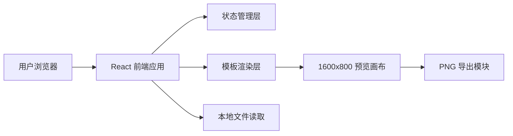

## 1. 架构设计
首版采用纯前端架构，所有素材处理、模板切换、预览渲染与图片导出均在浏览器本地完成，不依赖后端服务。



## 2. 技术说明
- 前端：React + TypeScript + Vite
- 状态管理：Zustand
- 样式方案：Tailwind CSS 与 CSS Variables 结合，用于快速搭建编辑器与模板视觉系统
- 导出能力：`html-to-image`，将画布节点导出为固定尺寸 PNG
- 图标：`lucide-react`
- 测试：Vitest + React Testing Library

## 3. 路由定义
| 路由 | 用途 |
|-------|---------|
| `/` | 首页，展示产品价值、模板类型与开始制作入口 |
| `/editor` | 编辑台，完成上传截图、切换模板、微调内容、导出图片 |

## 4. 数据定义
### 4.1 核心 TypeScript 类型
```ts
type TemplateId =
  | 'hero'
  | 'highlights'
  | 'cards'
  | 'steps'
  | 'compare'
  | 'metrics'
  | 'devices'
  | 'case'

interface UploadedAsset {
  id: string
  name: string
  dataUrl: string
}

interface AnnotationItem {
  id: string
  title: string
  description: string
}

interface PosterContent {
  brandName: string
  title: string
  subtitle: string
  ctaText: string
  badges: string[]
  metrics: string[]
  highlights: AnnotationItem[]
}

interface EditorState {
  activeTemplate: TemplateId
  assets: UploadedAsset[]
  content: PosterContent
  accentColor: string
  backgroundMode: 'dark' | 'light' | 'aurora'
}
```

### 4.2 本地状态策略
- 所有编辑数据保存在前端内存状态中，首版无需持久化。
- 模板切换只改变展示骨架，不破坏已填写文案。
- 上传素材转换为 Data URL，供画布预览与导出复用。

## 5. 模块拆分
| 模块 | 职责 |
|------|------|
| `src/pages/HomePage.tsx` | 首页展示、模板预览与跳转 |
| `src/pages/EditorPage.tsx` | 编辑台总布局与交互组织 |
| `src/components/editor` | 上传、文案配置、颜色配置、模板列表等编辑器组件 |
| `src/components/poster` | 各模板画布组件与通用装饰组件 |
| `src/store` | 编辑器状态、模板配置、导出逻辑入口 |
| `src/utils` | 文件读取、下载导出、颜色处理、模板辅助函数 |

## 6. 关键实现说明
- 预览区域使用固定逻辑尺寸 `1600 × 800`，页面中按容器宽度缩放显示，导出时仍使用原始逻辑尺寸。
- 模板系统由统一的模板元数据驱动，每个模板定义布局、所需素材数量、默认文案与视觉风格。
- 编辑面板使用分区配置，确保用户只在一个页面内完成所有操作。
- 为了保证导出稳定性，画布只使用浏览器可序列化的 DOM、CSS、图片资源，不依赖视频或复杂滤镜。

## 7. API 定义
首版无后端 API。

## 8. 风险与约束
- 大图上传会影响浏览器内存，首版需限制单图大小并提示压缩建议。
- `html-to-image` 对极复杂阴影和滤镜支持有限，模板视觉需兼顾导出稳定性。
- 不支持跨设备同步，刷新页面后状态会丢失。
